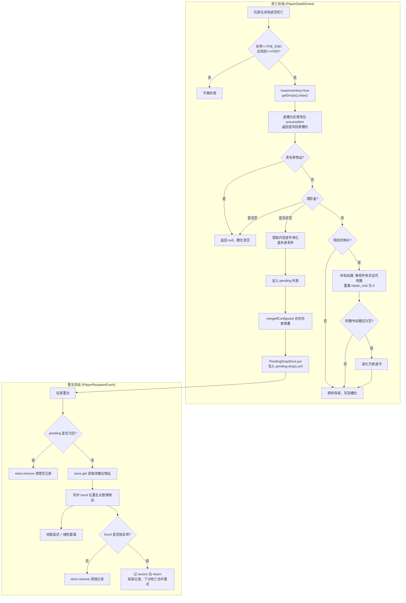
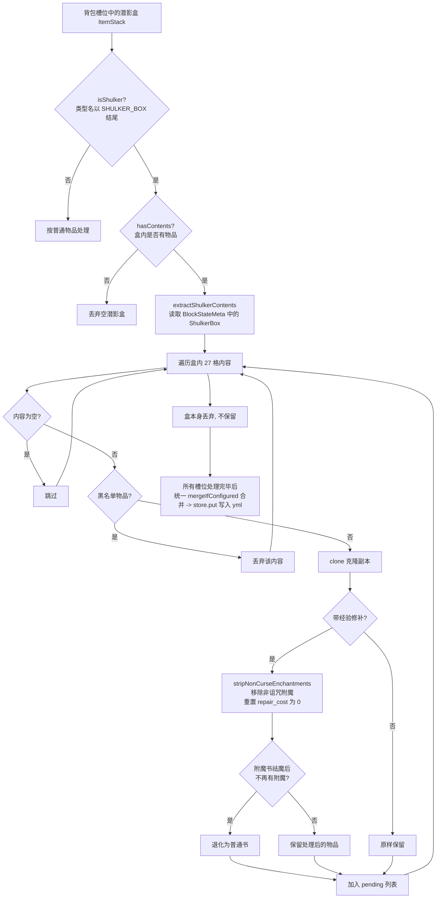
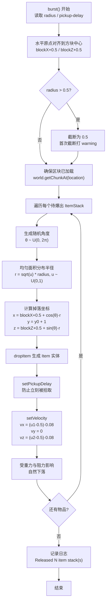

# EndVoidRescue 插件原理图

## 潜影盒处理原理图

## 收纳袋处理说明

- 背包中的收纳袋保留在原槽位，仅重写其内部物品列表。
- 黑名单物品从收纳袋内容中移除，带经验修补的物品执行砂轮式祛魔。
- 嵌套收纳袋递归执行相同规则，最多处理 15 层。
- 潜影盒内容中出现收纳袋时，先递归净化收纳袋，再将整个收纳袋加入待返还列表。

## 潜影盒物理效果流程图

### 符号含义

| 符号 | 含义 | 取值范围 / 说明 |
|------|------|----------------|
| $\theta$ | 随机角度 | $\theta \sim U(0, 2\pi)$，决定物品散落的水平方向 |
| $u, u_1, u_2$ | 均匀随机数 | $\sim U(0, 1)$，由 `random.nextDouble()` 生成 |
| $r$ | 散落半径 | $r = \sqrt{u} \cdot R$，使用平方根实现**均匀面积分布**，避免物品集中在圆心 |
| $R$ | 格内散落程度 | 来自 `burst.radius`，有效上限 $0.5$（更大值截断） |
| $x_0, y_0, z_0$ | 重生点坐标 | 水平对齐到所在方块中心；Y 为脚底 |
| $x, y, z$ | 物品生成坐标 | $x = \mathrm{blockX}+0.5 + \cos(\theta) \cdot r$ $y = y_0 + 1$ $z = \mathrm{blockZ}+0.5 + \sin(\theta) \cdot r$ |
| $v_x, v_y, v_z$ | 初速度分量 | $v_x = (u_1 - 0.5) \cdot 0.08$ $v_y = 0$ $v_z = (u_2 - 0.5) \cdot 0.08$ |
| $N$ | 物品堆叠数 | 本次爆出的 `ItemStack` 数量 |
